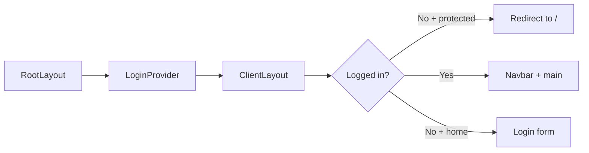

# tablet-snifim — Branch Portal

A **Next.js** (App Router) app for in-store tablets: a simple login screen, navigation to policy and report pages, and links to external systems (Salesbook, forms, WhatsApp, etc.).

## Tech Stack

| Technology | Role |
|------------|------|
| [Next.js](https://nextjs.org) 16 | React framework, routing (`src/app`), SSR / Client Components |
| React 19 | UI |
| TypeScript | Static typing |
| Tailwind CSS v4 | Styling and responsiveness |
| `localStorage` | Persists “logged in” state in the browser |

## Quick Start

```bash
npm install
npm run dev
```

Open [http://localhost:3000](http://localhost:3000).

Other scripts: `npm run build`, `npm run start`, `npm run lint`.

---

## Application Flow (Source to Screen)

1. **Bootstrap** — `RootLayout` wraps the app in `LoginProvider`, renders a top header with logos (`renuar.png`, `twentyfourseven.png`), and passes page content into `ClientLayout`.
2. **Auth readiness** — `LoginContext` reads `tablet-snifim-logged-in` from `localStorage` and sets `authReady` when the read completes.
3. **Route protection** — `ClientLayout` treats `/` as the login page and every other route as protected. If the user is not logged in and hits a protected route, they are redirected to `/` via `router.replace`.
4. **Login** (`/`) — User enters username and password; on success `login()` runs, state is stored in `localStorage`, then after a short delay navigation goes to `/company-policies`.
5. **After login** — `Navbar` (inside `<nav>` in `ClientLayout`) and page content inside `<main>` are shown.



---

## Core Files and Functions

### `src/app/layout.tsx`

| Symbol | Description |
|--------|-------------|
| `metadata` | SEO title and description: “הסניף שלנו”, portal description (Hebrew in app metadata). |
| `RootLayout` | Root layout: `html` with `lang="he"` and `dir="rtl"`, imports `globals.css`, wraps with `LoginProvider`, logo header, and `ClientLayout` with `children`. |

### `src/app/LoginContext.tsx`

| Symbol | Description |
|--------|-------------|
| `STORAGE_KEY` | Constant: `tablet-snifim-logged-in`. |
| `LoginProvider` | Provides context; `useEffect` loads from `localStorage` whether the user was marked logged in, then sets `authReady` to `true`. |
| `login` | Sets `loggedIn` to `true` and writes `'true'` to `localStorage`. |
| `logout` | Clears `loggedIn` and removes the key from `localStorage`. |
| `useLogin` | Hook for use inside `LoginProvider`; throws if used outside the provider. |

### `src/app/ClientLayout.tsx`

| Symbol | Description |
|--------|-------------|
| `ClientLayout` | Client component: reads `loggedIn`, `authReady`, `pathname`, `router`. Computes `isLoginPage`, `isProtectedRoute`, `showNavbar`. |
| `useEffect` | After `authReady`, if not logged in on a protected route — `router.replace('/')`. |
| Render guards | Until `authReady` — returns `null`. If not logged in on a protected route — `null`. Otherwise: optional `Navbar` and `children` in `main`. |

### `src/components/Navbar.tsx`

| Symbol | Description |
|--------|-------------|
| `navItems` | Array of links (label + `href`) to portal pages. The **Midrag** (`/midrag`) entry is commented out, so it does not appear in the menu. |
| `Navbar` | Shows title “הסניף שלנו”, desktop nav links, logout button, mobile hamburger menu (`menuOpen`). |
| `handleLogout` | Calls `logout()`, closes the menu, `router.push('/')`. |

### `src/app/page.tsx` (home — login)

| Symbol | Description |
|--------|-------------|
| `getDayOfWeekIsrael()` | Maps JavaScript weekday (Sunday = 0) to Israeli weekday numbering: Sunday → 1, Monday → 2, … Saturday → 7. |
| `getDayOfMonth()` | Returns the current calendar day of month (1–31). |
| `LoginPage` | Form: username and password. Expected values are **strings** for Israeli weekday number and day-of-month respectively. |
| `handleSubmit` | Prevents default form submit; on match — `login()`, success message, after 500ms navigate to `/company-policies`; else error `alert`. |

> **Security note:** Login is based on date-derived knowledge and does not identify individual users. Suitable only as a convenience gate in a controlled environment (e.g. a store tablet), not as real server-side authentication.

### `src/app/globals.css`

| Symbol | Description |
|--------|-------------|
| `@import "tailwindcss"` | Loads Tailwind v4. |
| `:root` / `@theme inline` | Base background and text variables. |
| `body` | Arial / Helvetica font stack. |
| `.bg-glilot` … `.bg-glilot6` | Background images from `/public` (`glilot1.png`–`glilot6.png`) for different pages. |

---

## Route Pages (`src/app/.../page.tsx`)

All of the following are **client components** (`'use client'`). Most render a grid of buttons or external links.

| Route | Component (name in code) | Purpose |
|-------|---------------------------|---------|
| `/company-policies` | `CompanyPoliciesPage` | `policies` array — links to PDFs on Salesbook (safety, code of ethics, accessibility, etc.). |
| `/cash-policies` | `CashPoliciesPage` | `policies` array — cash-desk policies (payments, gift card, EMV, commissions, etc.). |
| `/sales-reports` | `SalesReportsPage` | `reports` array — Salesbook sales reports. |
| `/support-tools` | `SupportToolsPage` | `tools` array — support tools and reports; includes a Google Form link. |
| `/new-employee-contract` | (default export named `BarcodeScanPage` in file) | `showIframe` state: button reveals an `iframe` to `renuar-lp.pages.dev` (external contract/form, `allow="camera"`). |
| `/barcode-scan` | `BarcodeScanPage` | `handleClick` navigates the window (`window.location.href`) to the external barcode training site. `useRouter` is imported but unused in the current file. |
| `/customer-service` | `customerservicePage` | WhatsApp link (`api.whatsapp.com`) and internal `Link` to `/`. |
| `/midrag` | `MidragPage` | “Midrag” page with a link to external reports. **Not** in `Navbar` because the nav item is commented out. |

---

## Static Assets

The `public/` folder holds logos, `glilot` backgrounds, default Next SVGs, etc. Files are served from the site root (`/filename`).

---

## Project Structure

```
tablet-snifim/
├── public/                         # Static files (images, SVGs)
│   ├── glilot1.png … glilot6.png   # Page backgrounds (CSS classes in globals.css)
│   ├── renuar.png, twentyfourseven.png
│   └── …
├── src/
│   ├── app/
│   │   ├── layout.tsx              # Root layout + LoginProvider + logo header
│   │   ├── ClientLayout.tsx        # Route guards, Navbar, main
│   │   ├── LoginContext.tsx        # Login state + localStorage
│   │   ├── page.tsx                # Login page (/)
│   │   ├── globals.css             # Tailwind + background utilities
│   │   ├── favicon.ico
│   │   ├── barcode-scan/page.tsx
│   │   ├── cash-policies/page.tsx
│   │   ├── company-policies/page.tsx
│   │   ├── customer-service/page.tsx
│   │   ├── midrag/page.tsx
│   │   ├── new-employee-contract/page.tsx
│   │   ├── sales-reports/page.tsx
│   │   └── support-tools/page.tsx
│   └── components/
│       └── Navbar.tsx
├── next.config.ts
├── postcss.config.mjs
├── tailwind.config.js
├── tsconfig.json
├── eslint.config.mjs
├── package.json
└── README.md
```

**Generated locally (not listed as source):** `node_modules/`, `.next/`.

---

## Deployment

You can deploy on [Vercel](https://vercel.com) or any host that supports Next.js. See the [Next.js deployment documentation](https://nextjs.org/docs/app/building-your-application/deploying).
